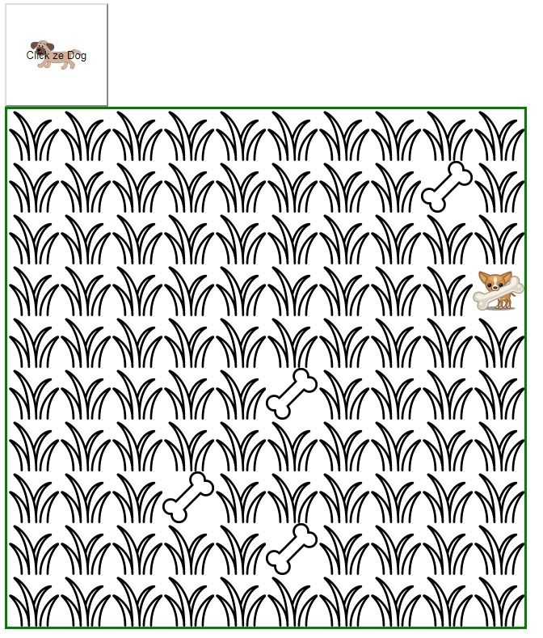

## Interactiunea simpla cu elementele din document
> a se vedea (js):
[metoda "getElementsByClassName()"](https://developer.mozilla.org/ro/docs/Web/API/Document/getElementsByClassName),
[metoda "querySelector()"](https://developer.mozilla.org/ro/docs/Web/API/Document/querySelector),
[atributele ".className" si ".classList"](https://developer.mozilla.org/ro/docs/Web/API/Element/className),
[atributul ".innerHTML" ](https://developer.mozilla.org/ro/docs/Web/API/Element/innerHTML),

---

Fiind date urmatorele fisiere, realizati un mic joc in care personajul principal, catelul "Pistrushka" cauta toate oasele
din gradina. Ideea jocului este urmatoarea: de fiece data utilizatorul apasa pe imaginea catelului - amplasata intr-un element
de tip buton, acesta "cauta" urmatorul os ascuns in gradina utilizand clasa "bone". Osul gasit este colorat datorita schimbarii clasei de stil al acestuia. Exact asa cum se arata in imaginea de mai jos



Fisierele cu codul-sursa de la care va trebui sa incepeti dezvoltarea jocului

### game.html

```html
<!DOCTYPE html>
<html lang="en">
<head>
  <meta charset="UTF-8">
  <meta name="viewport" content="width=device-width, initial-scale=1.0">
  <meta http-equiv="X-UA-Compatible" content="ie=edge">
  <link rel="stylesheet" href="game.css">
  <title>Document</title>
</head>
<body>

  <button>Click ze Dog</button>
  <div id="yard">
    <div class="grass"></div>
    <div class="grass"></div>
    <div class="grass"></div>
    <div class="grass"></div>
    <div class="grass"></div>
    <div class="grass"></div>
    <div class="grass"></div>
    <div class="grass"></div>
    <div class="grass"></div>
    <div class="grass"></div>
    <div class="grass"></div>
    <div class="grass"></div>
    <div class="grass"></div>
    <div class="grass"></div>
    <div class="grass"></div>
    <div class="grass"></div>
    <div class="grass"></div>
    <div class="grass"></div>
    <div class="bone"></div>
    <div class="grass"></div>
    <div class="grass"></div>
    <div class="grass"></div>
    <div class="grass"></div>
    <div class="grass"></div>
    <div class="grass"></div>
    <div class="grass"></div>
    <div class="grass"></div>
    <div class="grass"></div>
    <div class="grass"></div>
    <div class="grass"></div>
    <div class="grass"></div>
    <div class="grass"></div>
    <div class="grass"></div>
    <div class="grass"></div>
    <div class="grass"></div>
    <div class="grass"></div>
    <div class="grass"></div>
    <div class="grass"></div>
    <div class="grass"></div>
    <div class="bone-found"></div>
    <div class="grass"></div>
    <div class="grass"></div>
    <div class="grass"></div>
    <div class="grass"></div>
    <div class="grass"></div>
    <div class="grass"></div>
    <div class="grass"></div>
    <div class="grass"></div>
    <div class="grass"></div>
    <div class="grass"></div>
    <div class="grass"></div>
    <div class="grass"></div>
    <div class="grass"></div>
    <div class="grass"></div>
    <div class="grass"></div>
    <div class="bone"></div>
    <div class="grass"></div>
    <div class="grass"></div>
    <div class="grass"></div>
    <div class="grass"></div>
    <div class="grass"></div>
    <div class="grass"></div>
    <div class="grass"></div>
    <div class="grass"></div>
    <div class="grass"></div>
    <div class="grass"></div>
    <div class="grass"></div>
    <div class="grass"></div>
    <div class="grass"></div>
    <div class="grass"></div>
    <div class="grass"></div>
    <div class="grass"></div>
    <div class="grass"></div>
    <div class="bone"></div>
    <div class="grass"></div>
    <div class="grass"></div>
    <div class="grass"></div>
    <div class="grass"></div>
    <div class="grass"></div>
    <div class="grass"></div>
    <div class="grass"></div>
    <div class="grass"></div>
    <div class="grass"></div>
    <div class="grass"></div>
    <div class="grass"></div>
    <div class="bone"></div>
    <div class="grass"></div>
    <div class="grass"></div>
    <div class="grass"></div>
    <div class="grass"></div>
    <div class="grass"></div>
    <div class="grass"></div>
    <div class="grass"></div>
    <div class="grass"></div>
    <div class="grass"></div>
    <div class="grass"></div>
    <div class="grass"></div>
    <div class="grass"></div>
    <div class="grass"></div>
    <div class="grass"></div>
  </div>

  <script src="game.js"></script>
</body>
</html>


```

### game.css

```css
#yard{
  border:3px solid green;
  width:640px;
  height: 640px;
}
#yard div{
  width: 64px;
  height: 64px;
  float:left;
}
#yard .grass{
  background: url(./grass.png);
}
#yard .bone{
  background: url(./bone.png);
}
#yard .bone-found{
  background: url(./bone-found.png);
}

button{
  background: url(./dog.png) no-repeat center;
  width: 128px;
  height: 128px;
}


```

### game.js

```javascript

   function findNextBone(){
     // Algoritmul functiei:
     // * sa se caute primul element "div" dupa clasa "bone" puteti utilizat querySelector() sau getElementsByClassName()
     // * sa se schimbe clasa acestui element - daca a fost gasit, in "bone-found"
     // * atentie!!! in cazul in care elementul nu poate fi gasit querySelector() returneaza null, iar getElementsByClassName() returneaza o colectie cu zero elemente 0 proprietatea .length
     // * in cazul in care nu mai sunt gasit oase, sa se afiseze mesajul "GAME OVER" care va inlocui toate elementele DIV din interiorul "#yard", puteti utiliza proprietatea .innerHTML
   }
```
Functia data trebuie sa reactioneze la fiecare apasare pe buttonul cu catel.

* BONUS: utilizand ```javascript Math.random()``` incercati sa faceti in asa mod incat la fiecare incarcare de document, oasele sa fie amplasate aliator pe harta.

---
